# Index

## [Introduction](#introduction-1)

- [Why is this a method?](#why-is-this-a-method)

## [Nidus Loadout](#nidus-loadout-1)

- [Nidus Build](#build)
- [Archon shards](#archon-shards)
- [Glaxion vandal](#glaxion-vandal)
- [Ripkas](#ripkas)

## [Nidus Procedure](#nidus-procedure-1)

## [Nidus Example Runs](#nidus-gameplay)

## [Khora Loadout](#khora-loadout-1)

- [Khora Build](#build-1)
- [Archon shards](#archon-shards-1)
- [Prisma Skana](#prisma-skana)

## [Khora Procedure](#khora-procedure-1)

## [Khora Example Runs](#khora-gameplay)

## [Credits](#credits)

---

# Introduction

## Why is this a method?

Why should you one pull? The runs are around 1 second faster per wave which adds up. Additionally it has more room for error in terms of larva placement and is easier to know where to pull. The downside is it requires more skill from both the nidus and khora.

---

## Nidus Loadout

### Build

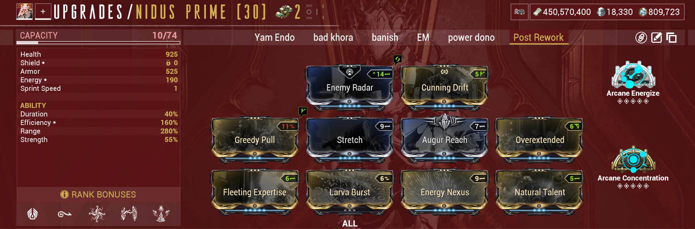

### Archon shards

### Glaxion vandal

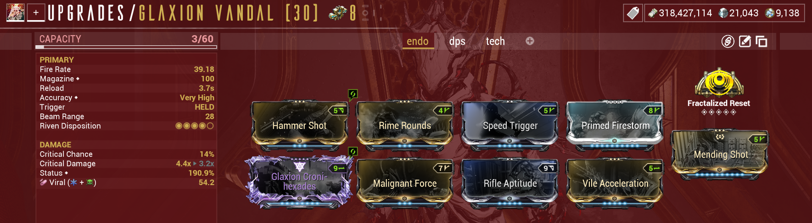

### Ripkas

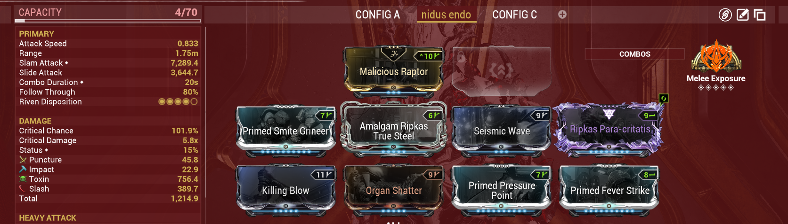

### Notes

- Glaxion riven and full build are optional but allows for less delays between waves, resulting in faster waves
- Glaxion riven is fr sc -harmless stat (no riven runs catalyzer link)
- Ripkas riven is cc ic md -harmless stat (no riven runs corrupt charge)

---

# Nidus Procedure

1. do rollout like normal
2. once you pull the enemies to the bridge, heavy slam them
3. grab health orb over here with your glaxion, you may have to jump slightly towards it
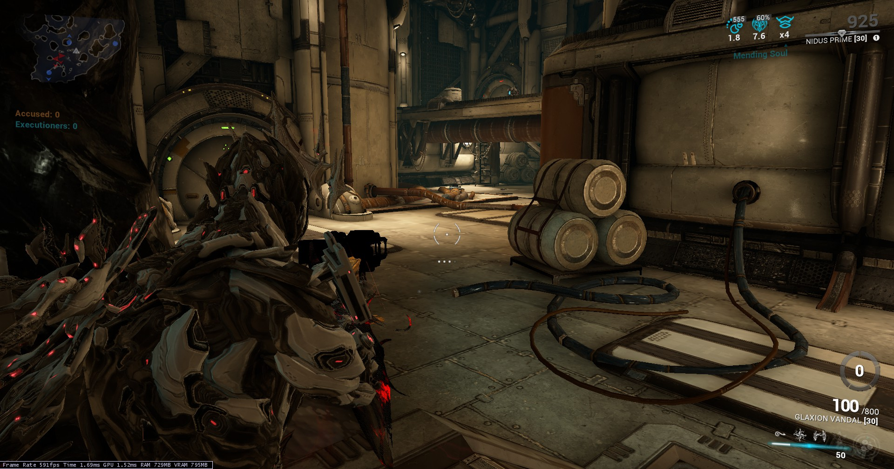
4. move into the left side of the bridge (where khora normally stands)
5. look at this afk spot to manipulate the enemy spawns
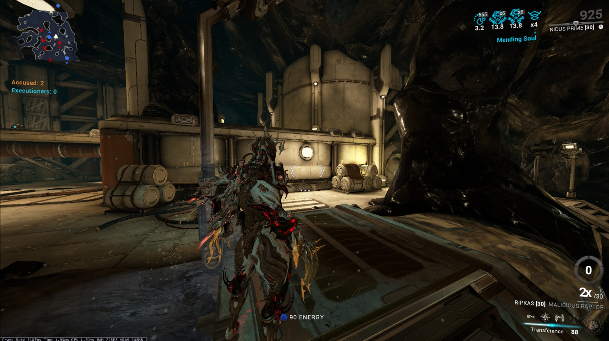
6. once all enemies have spawned, turn around and throw your larva here if you hit your khora it doesn't matter, in fact it may be better as you get better line of sight on the enemies
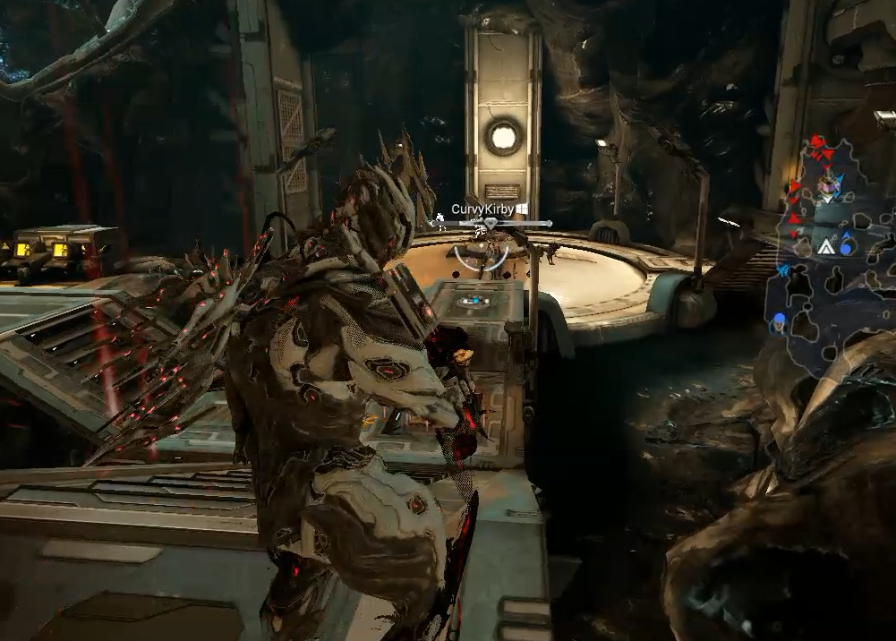
7. pop your lake larva the second you see that the farthest enemy  from the lake spot starts moving which is almost always these spawns circled in purple, not doing this will cause the enemies to either not have enough momentum or too much momentum. If these enemies do not spawn you can insta pop
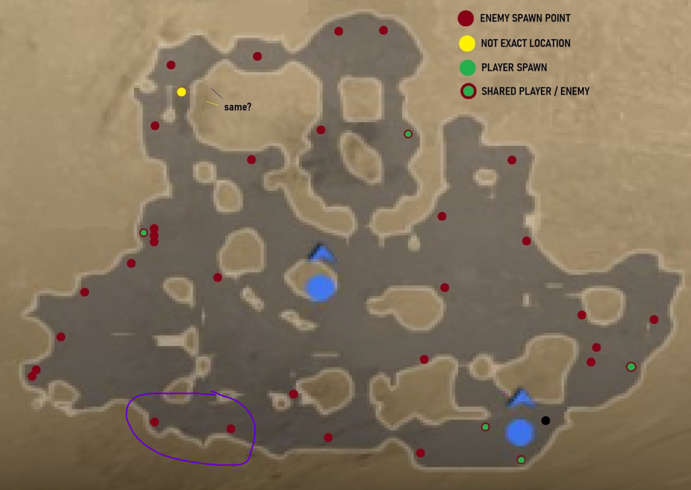
8. after popping your larva prime the enemies using your glaxion, then jump towards the endo spot and grab the endo using mag's pull
9. repeat steps 4-8 until the match ends

---

# Nidus Gameplay

- https://medal.tv/games/warframe/clips/n6PDmmMB65JYWu8dA?invite=cr-MSxuYjQsMTA3MDE3MzE4
- https://medal.tv/games/warframe/clips/n4obJiIwHGupARop4?invite=cr-MSxscHQsMTA3MDE3MzE4

---

## Khora Loadout

### Build

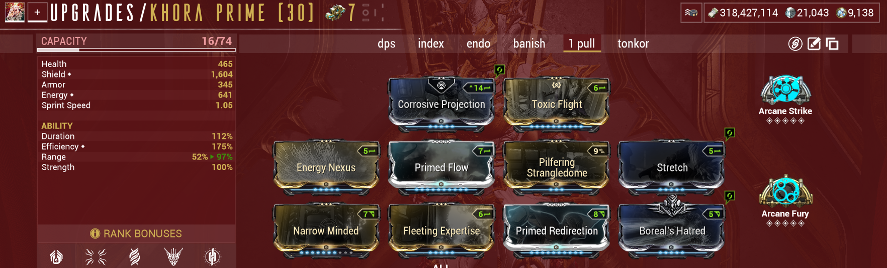

### Archon shards

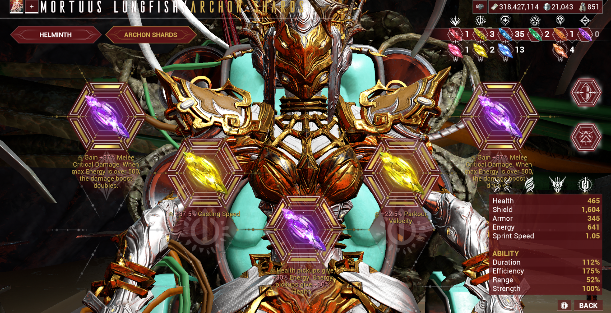

### Prisma Skana

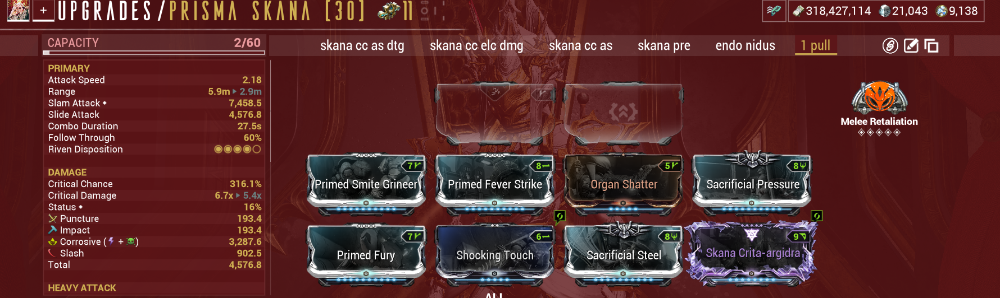

### Notes

- if you don't have the capacity to fit both sacrificial steel and pressure run galvanized pressure and primed pressure point instead
- your skana build will most likely change depending on your riven

---

# Khora Procedure

1. do rollout like normal
2. once you land on the bridge and place cage, go op, press 2 then sling and leave operator
3. kill the enemies when the appear in cage
4. grab the health orb in the lake area and move to this spot
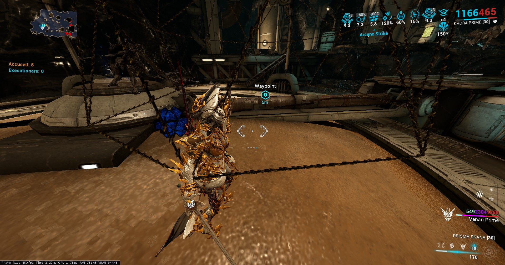
5.  once the names disapear sling yourself and cast vazarin 2, either place the ability on your warframe  so the location the enemies are pulled to is elevated, or cast is where you put the cage. Tip: dont look directly down or straight while placing it, stand to the left or right of the sideways pole while still being on it, and cast it at that angle
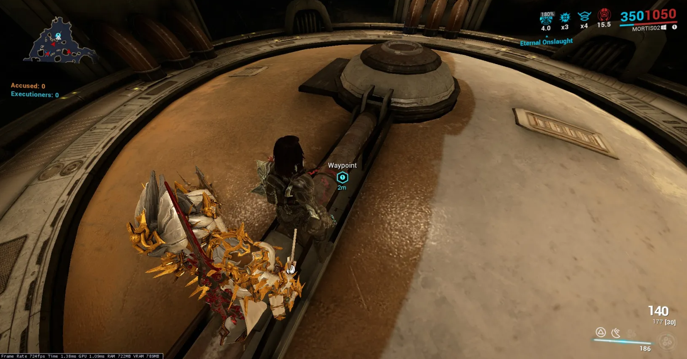

## Non-Reinforcment Modifier (Tougher Enemies, Reduced Ability Duration)

6. look at this spot before the enemies spawn
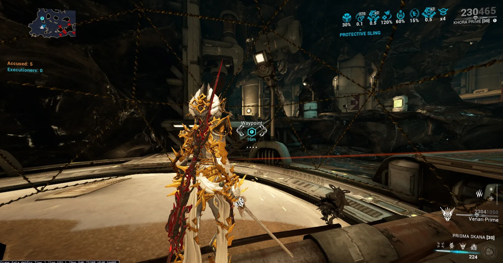
7. either when the enemies are about to spawn, or when they do, cast cage and sling yourself while the cage is being placed to cancel the animation

## Reinforcment Modifier

6. cast your cage when the names disappear
7. before the enemies spawn you have to Jump upwards and slightly to the right and aimglide looking around where the crosshair is placed. (or you can move right and jump upwards while aimgliding)
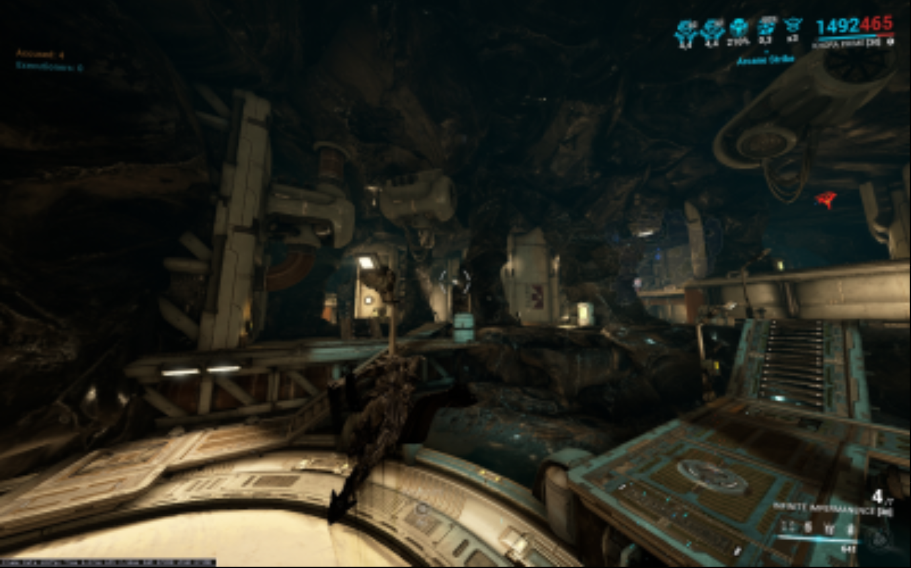

8. wait for the nidus to pull the enemies into the cage, and once you see them infront of you start attacking
9. make sure to chop the bodies then sling
10. repeat steps 5-9 until the run ends

---

# Khora Gameplay

- https://medal.tv/games/warframe/clips/n5auIyokvGT-2mRcl?invite=cr-MSw3RFQsMjE5NDE4MjMx
- https://medal.tv/games/warframe/clips/n4obL9oTXLFfJ2L5x?invite=cr-MSxvOHksMjE5NDE4MjMx&v=72

# Credits

[__**WFPedia's creators**__](https://wfpedia.com/posts/endo/basics) - Making an endo guide in the first place.

__**-oyo-**__ 
  Created guide template and inspried me to upload a guide to github.
__**Obliterate**__
  Helped test and brianstorm ideas for this strategy.
__**CurvyKirby**__
  Helped test and brianstorm ideas for this strategy.
__**The One Pull Dream V1**__
  https://discord.com/channels/1042561095094763644/1291677621914177567